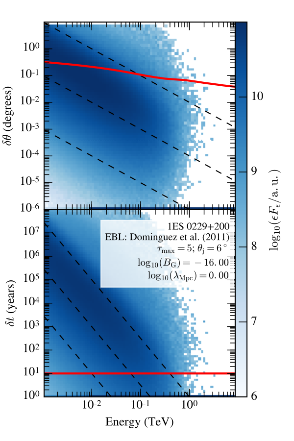

History
======================
Preparation
------------
Abbreviation
^^^^^^^^^^^^^
- EGBL : extragalactic background light.
- IGMF : intergalatic magnetic field
- CTA [1]_ : Cherenkov telescope array.
- VHE : very high energy

`A story about gamma ray astronomy <https://imagine.gsfc.nasa.gov/science/toolbox/gamma_ray_astronomy1.html>`_
^^^^^^^^^^^^^^^^^^^^^^^^^^^^^^^^^^^^^^^^^^^^^^^^^^^^^^^^^^^^^^^^^^^^^^^^^^^^^^^^^^^^^^^^^^^^^^^^^^^^^^^^^^^^^^^^
.. seealso::

    If you could see gamma-rays, the night sky would look strange and unfamiliar.
    The familiar sights of constantly shining stars and galaxies would be replaced
    by something ever-changing. Your gamma-ray vision would peer into the hearts
    of solar flares, supernovae, neutron stars, black holes, and active galaxies.
    Gamma-ray astronomy presents unique opportunities to explore these exotic objects.

How astronomer get data?
^^^^^^^^^^^^^^^^^^^^^^^^^
- From the Satellite to the Ground
- Data Processing
- Data Archives
- Data Analysis

  - Light Curves
  - Spectrum
  - Images

Phenomenology
--------------
Gamma ray induced cascade
^^^^^^^^^^^^^^^^^^^^^^^^^^^^
We present the results of Monte Carlo simulations of three-dimensional
electromagnetic cascade initiated by interactions of the multi-TeV γ rays with
the cosmological infrared/optical photon background in the intergalactic medium.

That is to say, gamma ray sources are still not entirely freed from the influence
of the EGMF. VHE gamma rays can interact with background photons through the pair
production interaction :math:`\gamma_{VHE}` + :math:`\gamma_b` → :math:`e^+` +
:math:`e^-`. If the initial gamma ray was energetic enough, both the electron
and positron produced can transfer their energy on to additional background
photons through inverse Compton scattering e + :math:`\gamma_b` →
:math:`\gamma_{VHE}` + :math:`e'` . If the initial gamma ray was of particularly high
energy, this process can carry on and results in a single VHE gamma ray
producing a multitude of high energy photons. This process is called an
electromagnetic cascade.

How do we simulate the process of electromagnetic cascade?
^^^^^^^^^^^^^^^^^^^^^^^^^^^^^^^^^^^^^^^^^^^^^^^^^^^^^^^^^^^^^
We simulate the delay time :math:`\delta t` and deflection angle :math:`\delta
\theta` with respect to energy of original gamma photon using the open source
Monte Carlo code.


Here need large amount of words to explain this figure.



   Arxiv: `1603.03431v3`_

   An example of the output photon distribution as a function of energy and
   :math:`\delta
   \theta` (:math:`\delta t`) for one pair of (B, λ) values for 1ES 0229+200

.. _1603.03431v3: https://arxiv.org/abs/1603.03431

:math:`D_{IC}` refers to the distance of Inverse Compton process. Put it in
another way, it means until the electrons(here electron both electron and
positron) cool down, the distance it travels.

According to the , :math:`D_{IC}` must be small, to understand it intuitively,

.. math::

   D_{IC} = \frac{3m_e c^2}{4\sigma_T u_{CMB}\gamma}\approx 0.7(\frac{E}
   {\mathrm{TeV}})^{-1}\mathrm{Mpc}

Thomas cross section

ELMAG simulations
^^^^^^^^^^^^^^^^^^
The codes output total observed spectrum εFε with primary and cascade emission
binned in energy, angular separation :math:`\delta t`, and time delay
:math:`\delta \theta`.

Modelling of the cascade process
`````````````````````````````````

`Flux density <http://www.astro.caltech.edu/~george/ay20/Ay20-Lec3x.pdf>`_
````````````````````````````````````````````````````````````````````````````
Real detectors are sensitive over a finite range of :math:`\lambda` (or :math:`\nu`)
Flux are always measured over some finite bandpass. Total energy [2]_ is :math:`F =
\int f_{\nu}(\nu)d\nu`, Integral of :math:`f_{\nu}` over all frequencies.


.. rubric:: Footnotes
.. [1] CTA will be ten times more sensitive and have unprecedented accuracy in
       its detection of high-energy gamma rays
.. [2] :math:`1 \mathrm{erg} = 10^{−7} \mathrm{J} = 100 \mathrm{nJ}`
