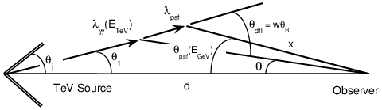

Literature
================
Crucial features
---------------------
The deflection of electron/positron pairs in the intergalactic magnetic field can lead to observable effects, including

  - a time dispersion
  - spectral signatures
  - as well as an apparent extension.

.. important::

   What we observe is not nature in itself but nature exposed to our method of questioning.

Literature
--------------
1. Lower Limit on the Strength and Filling Factor of Extragalactic Magnetic Fields. `arXiv:1009.1782`_
^^^^^^^^^^^^^^^^^^^^^^^^^^^^^^^^^^^^^^^^^^^^^^^^^^^^^^^^^^^^^^^^^^^^^^^^^^^^^^^^^^^^^^^^^^^^^^^^^^^^^^^
.. _arXiv:1009.1782: https://arxiv.org/abs/1009.1782v2<https://arxiv.org/abs/1009.1782v2

2. Time Delay of Cascade Radiation for TeV Blazers and the Measurement of the Intergalactic Magnetic Field. `arXiv:1011.6660`_
^^^^^^^^^^^^^^^^^^^^^^^^^^^^^^^^^^^^^^^^^^^^^^^^^^^^^^^^^^^^^^^^^^^^^^^^^^^^^^^^^^^^^^^^^^^^^^^^^^^^^^^^^^^^^^^^^^^^^^^^^^^^^^^^

.. math::

   c\Delta t = \lambda_{\gamma \gamma} + x - d

You can tell from law of sines that  :math:`x = \frac{d\sin \theta_1}{\sin \theta_{dfl}}` and
:math:`\lambda_{\gamma \gamma} = \frac{d\sin \theta}{\sin \theta_{dfl}}`

.. math::

   c\Delta t &= &\lambda_{\gamma \gamma} +  \frac{d\sin (\theta_{dfl} -\theta)}{\sin \theta_{dfl}} -d\\
             &= &\lambda_{\gamma \gamma}( 1 - \cos \theta_{dfl}) + d(\cos \theta - 1)

.. _arXiv:1011.6660: https://arxiv.org/abs/1011.6660

3. Gamma rays as probes of the Universe. `arXiv:1602.06825`_
^^^^^^^^^^^^^^^^^^^^^^^^^^^^^^^^^^^^^^^^^^^^^^^^^^^^^^^^^^^^^^^^^^

.. _arXiv:1602.06825: https://arxiv.org/abs/1602.06825?context=astro-ph.HE

4. Measuring the correlation length of intergalactic magnetic fields from observations of gamma-ray induced cascades. `arXiv:13072753`_
^^^^^^^^^^^^^^^^^^^^^^^^^^^^^^^^^^^^^^^^^^^^^^^^^^^^^^^^^^^^^^^^^^^^^^^^^^^^^^^^^^^^^^^^^^^^^^^^^^^^^^^^^^^^^^^^^^^^^^^^^^^^^^^^^^^^^^^^^^^^^^^
.. _arXiv:13072753: https://arxiv.org/abs/1307.2753
